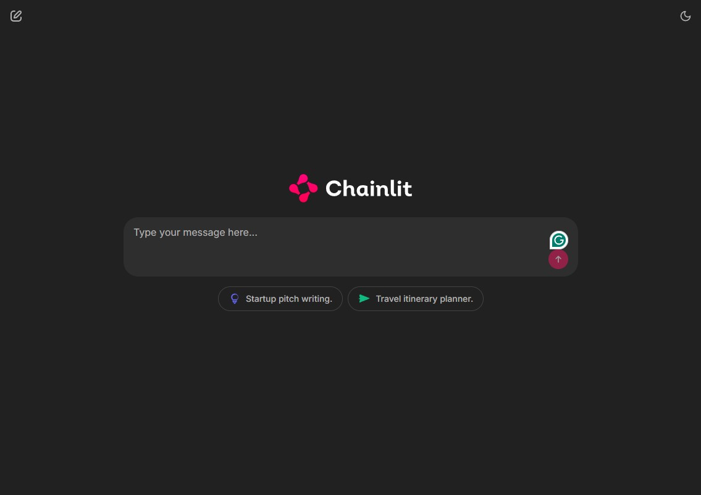

Check out the configuration reference at https://huggingface.co/docs/hub/spaces-config-reference


# 🤖 AI Chatbot with Gemini & OpenAI Agents

An AI chatbot project powered by **Google Gemini** and **OpenAI** models using an agentic framework. Built with **FastAPI** and **Chainlit**, containerized using **Docker**, managed with [`uv`](https://github.com/astral-sh/uv), and deployed via **Hugging Face Spaces**.


🟢 **Live App:** [Demo](https://muhammadarman-ai-chatbot.hf.space/)
<p align="center">
  
</p>

## 🚀 Features

- 🌐 Chainlit-powered web UI with starter prompts
- 🧠 Agent-based logic using OpenAI SDK + Gemini models
- ⚡ FastAPI backend for API flexibility
- 🎨 Styled with `custom.css` for a clean UI
- 🐳 Docker-ready for consistent environments
- ☁️ Deployable on Hugging Face Spaces
Hey, Cortana. 
---

## 🧩 Tech Stack

| Technology        | Purpose                                 |
|------------------|------------------------------------------|
| **FastAPI**       | Backend API server                      |
| **Chainlit**      | Frontend interface for the chatbot      |
| **Google Gemini** | Language model (via API)                |
| **OpenAI SDK**    | Agentic framework for orchestration     |
| **Docker**        | Containerization                        |
| **Hugging Face**  | App hosting and deployment              |
| **uv**            | Package and environment management      |

---

 
## ⚙️ Setup Instructions

### 1. Clone the Repository

```bash
git clone https://github.com/arman229/ai_chatbot.git
cd ai_chatbot
```

### 2. Create a Virtual Environment

Using [`uv`](https://github.com/astral-sh/uv):

```bash
uv venv
.venv\Scripts\activate
uv pip install pyproject.toml

```

### 3. Configure Environment

Create a `.env` file in the root directory:

```env
GEMINI_API_KEY=your_gemini_api_key_here
```

### 4. Run Locally

#### Start FastAPI backend:

```bash
uvicorn chatbot.main:app --reload
```
 

Access it at: [http://localhost:8000](http://localhost:8000)

---

## 🐳 Docker Usage  

### Build the Image

```bash
docker build -t ai_chatbot .
```

### Run the Container

```bash
docker run -p 8000:8000  ai_chatbot
```


## 🚀 Deployment on Hugging Face

1. Create a new Space on [Hugging Face](https://huggingface.co/spaces).
2. Choose "Docker" as the runtime.
3. Connect your GitHub repo or manually upload your project.
4. Hugging Face will automatically build and deploy your app.


  
 
